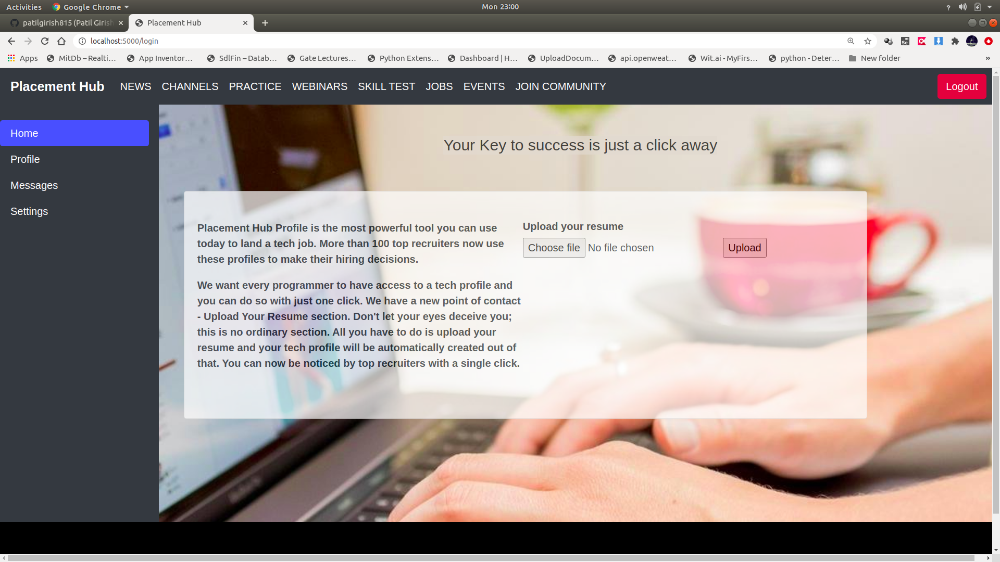
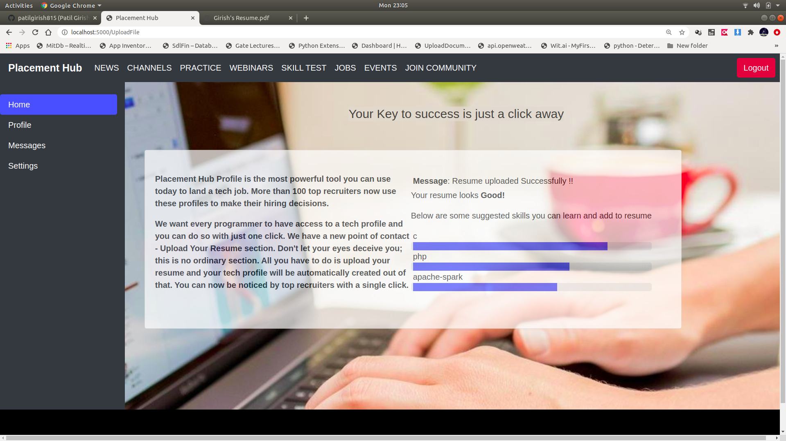
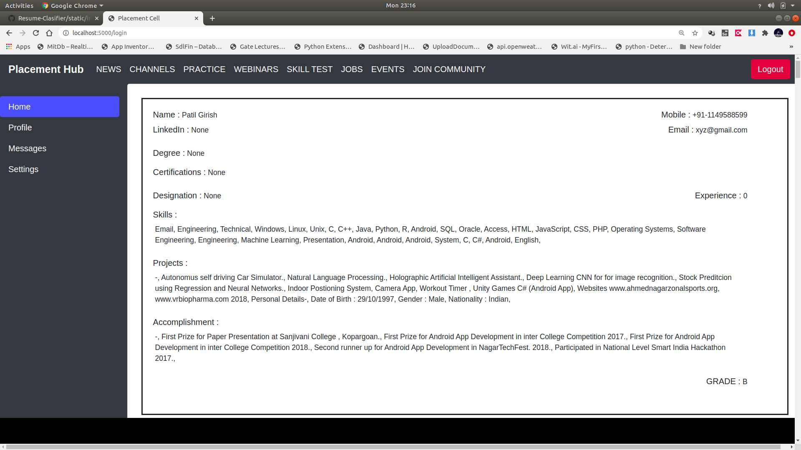

# Resume_Clasifier_Using_Machine_Learning
The goal of this project is to classify the resume in Grades A,B,C and D based on certain attributes laid out by the IT recruiters. In addition of classifying the resumes, user uploading resume is given some suggested skills to add up in the resume. 

### To run application

1. Build docker image using
$ docker build -t resume-classifier .

2. Run the application
$ docker run -p 5000:5000

3. In Browser open URL localhost:5000

4. Login Using:
   - Username : test
   - Password : test
   - Role : To upload the resume on site. 
   
   - Username :admin
   - Password :admin
   - Role : Get all classified grades of resume.
   
   - *Note : Username and password can be chnaged in server.py file

#### Landing page of application

#### Page to upload resume

#### Suggestions after uploading resume

#### Auto resume parsing and classification in Grade

